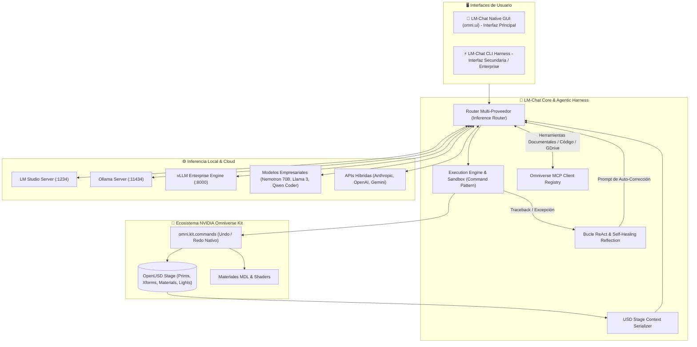

# LM-Chat™ - Technical Brand & Product Specification Document

```
===================================================================
    __    __  ___        ________          __ 
   / /   /  |/  /       / ____/ /_  ____ _/ /_
  / /   / /|_/ /  ____ / /   / __ \/ __ `/ __/
 / /___/ /  / /  /___// /___/ / / / /_/ / /_  
/_____/_/  /_/        \____/_/ /_/\__,_/\__/  
                                              
   LM-Chat™ Enterprise Suite - NVIDIA Omniverse Agentic Layer
===================================================================
```

## 1. Brand Identity & Product Hierarchy

- **Commercial Brand:** **LM-Chat™**
- **NVIDIA Omniverse Extension ID:** `omni.lm_chat`
- **CLI Harness Brand:** **LM-Chat CLI** (`cli/lmchat_cli.py`)
- **Package Title:** LM-Chat
- **Target Runtime:** NVIDIA Omniverse Kit SDK 105 / 106 / 107+ (USD Composer, Isaac Sim, Omniverse Code)
- **Tagline:** *The Native Autonomous Spatial AI Copilot for NVIDIA Omniverse.*
- **Lead Architect & Author:** Orlando Dorival

---

## 2. Core Value Proposition

**LM-Chat™** is an enterprise-grade Autonomous Spatial AI suite and neural copilot designed specifically for the NVIDIA Omniverse ecosystem. By bridging advanced Large Language Models (LLMs) with 3D OpenUSD (Universal Scene Description), LM-Chat™ transforms Omniverse into an interactive, voice/text-driven virtual engineering studio. Creators, robotics engineers, and digital twin architects can conceive, manipulate, inspect, and simulate complex 3D environments in real time using natural language.

---

## 3. Architecture & Technical Pillars



### 3.1. Agnostic Multi-Provider Router (`logic/inference_router.py`)
Provides seamless, zero-latency inference across heterogeneous local and cloud providers:
- **Local Air-Gapped Providers:**
  - **LM Studio:** `http://localhost:1234/v1` (Tested with `google/gemma-4-e4b` on RTX 5060 Ti).
  - **Ollama:** `http://localhost:11434/v1` (Llama 3.3, Qwen 2.5 Coder, Mistral).
  - **vLLM / Enterprise Local:** `http://localhost:8000/v1` (NVIDIA Nemotron 70B, DeepSeek-R1).
- **Cloud / Hybrid Providers:**
  - **Google Gemini:** Direct OpenAI-compatible streaming API (`gemini-2.5-flash`, `gemini-3.6-flash`).
  - **Anthropic & OpenAI:** Standard cloud endpoints with custom timeouts up to 600s.

### 3.2. Spatial OpenUSD Context Serializer (`logic/spatial_usd_context.py`)
Extracts, simplifies, and injects the live 3D USD Stage hierarchy directly into the LLM system prompt. The model understands spatial prim hierarchies, geometric bounds, transform matrices, light properties, and physics configurations before writing a single line of code.

### 3.3. Self-Healing ReAct Reflection Loop (`logic/agent_manager.py`)
When generated Python scripts encounter runtime exceptions (e.g. invalid USD paths, missing prims, type mismatch), LM-Chat intercepts the traceback, formats an internal reflection payload, and prompts the LLM to self-correct autonomously without user intervention (up to 3 configurable retry attempts).

### 3.4. Non-Destructive Execution Engine
All stage modifications utilize the Omniverse Command Pattern (`omni.kit.commands`). Every prim creation, transformation, or material binding is fully registered in Omniverse's Undo/Redo stack (`Ctrl+Z` / `Ctrl+Y`), guaranteeing non-destructive operations on production stages.

### 3.5. Model Context Protocol (MCP) Client Registry (`mcp/client_registry.py`)
Built on JSON-RPC 2.0 specifications, allowing the AI agent to dynamically load MCP servers (e.g., Google Drive, local documentation, GitHub) to read blueprints, CAD specs, and manufacturing requirements.

---

## 4. Interfaces & Operational Modes

### 4.1. Primary Interface: Native Omniverse GUI (`omni.ui`)
- **Dockable Window:** Embeds into the Omniverse Kit layout alongside the Viewport, Stage Tree, and Property panel.
- **Asynchronous 60 FPS:** Uses `urllib` and `asyncio.run_in_executor` to prevent UI thread lockups during heavy inference.
- **Dynamic Status Badge:** Visual feedback indicating `LISTO`, `PENSANDO...`, `EJECUTANDO CÓDIGO...`, `AUTOCORRIGIENDO...`.

### 4.2. Secondary Interface: LM-Chat Enterprise CLI (`cli/lmchat_cli.py`)
- **Interactive REPL:** Full-featured terminal console with slash commands (`/switch`, `/model`, `/url`, `/key`, `/status`, `/clear`, `/exit`).
- **Headless Execution:** Designed for CI/CD pipelines, automated synthetic data generation, and batch OpenUSD asset creation.
```bash
# Launch interactive REPL
python cli/lmchat_cli.py --provider lm_studio

# Headless autonomous batch generation
python cli/lmchat_cli.py --provider cloud --model gemini-2.5-flash --prompt "Construye una escena con 5 cubos con física rígida y colores primarios"
```

---

## 5. Technical Identification Matrix

| Component | Technical Identifier | Legacy Identifier (Deprecated Alias) | Status |
| :--- | :--- | :--- | :--- |
| **Extension ID** | `omni.lm_chat` | `orlandoexplorer.ia_test` | **Official Active** |
| **Extension Class** | `LMChatExtension` | `MyExtension` | **Official Active** |
| **Kit Config** | `config/extension.toml` | N/A | **Official Active** |
| **CLI Class** | `LMChatCLI` | `OmniCLI` | **Official Active** |
| **CLI Entrypoint** | `cli/lmchat_cli.py` | `cli/omni_harness.py` | **Official Active** |
| **Brand Trademark** | **LM-Chat™** | `OmniAgent` / `ia_test` | **Official Active** |

---

## 6. Verification and Standards Compliance

- **Unit Test Coverage:** 100% passing across 37+ tests (`tests/test_hello_world.py`, `tests/test_inference_router.py`, `tests/test_mcp_client.py`, `tests/test_spatial_usd_context.py`, `tests/test_chat_window.py`).
- **NVIDIA Omniverse Compatibility:** Kit SDK 105, 106, 107 (Verified on Omniverse Kit 107.0.0-rc.37+release.189569.cfaee9bf.tc.windows-x86_64.release).
- **Physical Verification:** Verified locally with dynamic PhysX simulation (`scripts/demo_industrial_cell.py`, `stages/gemini_industrial_cell.usda`).
